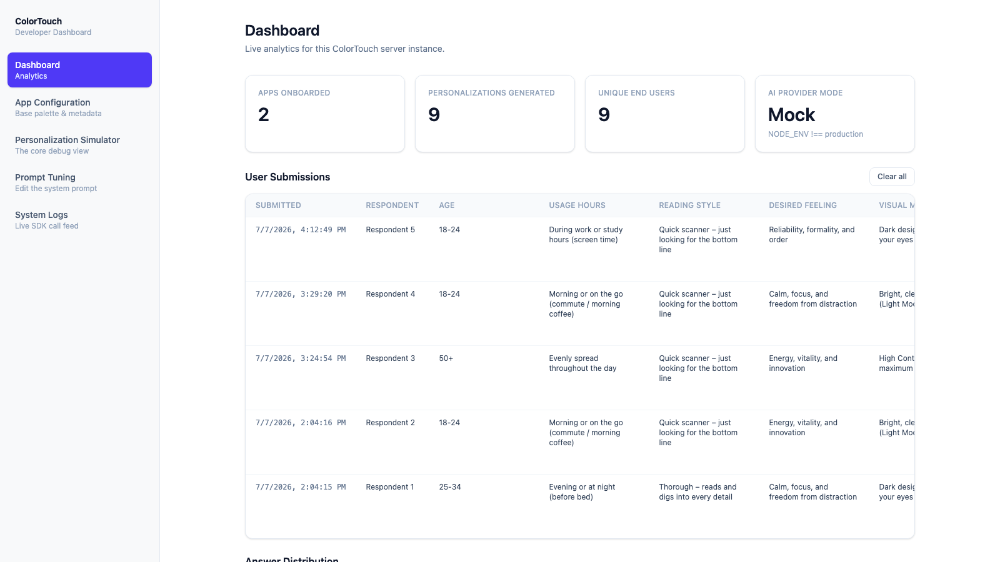
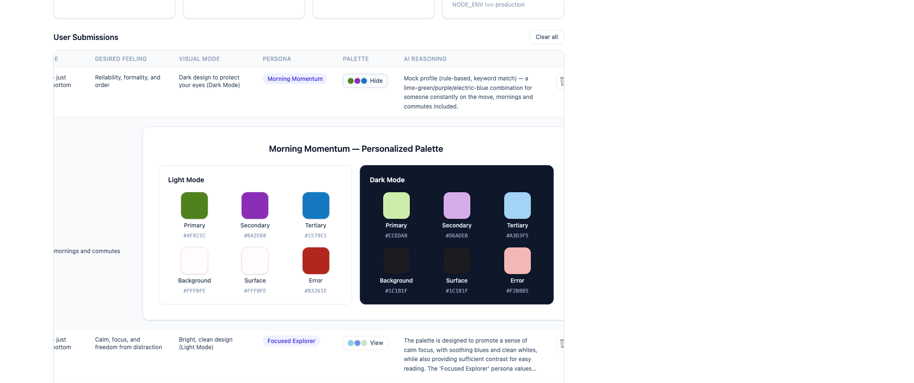
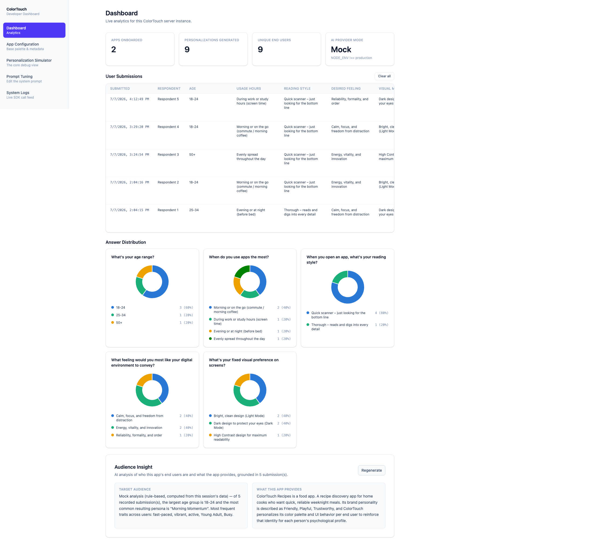
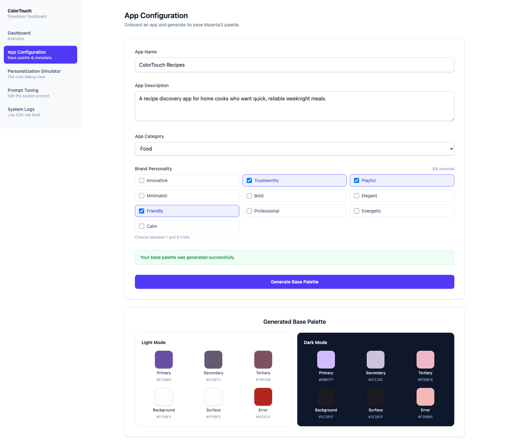
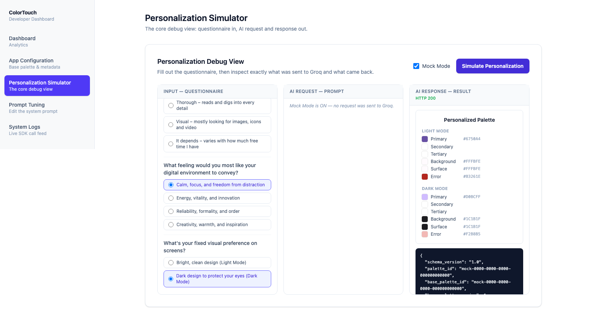
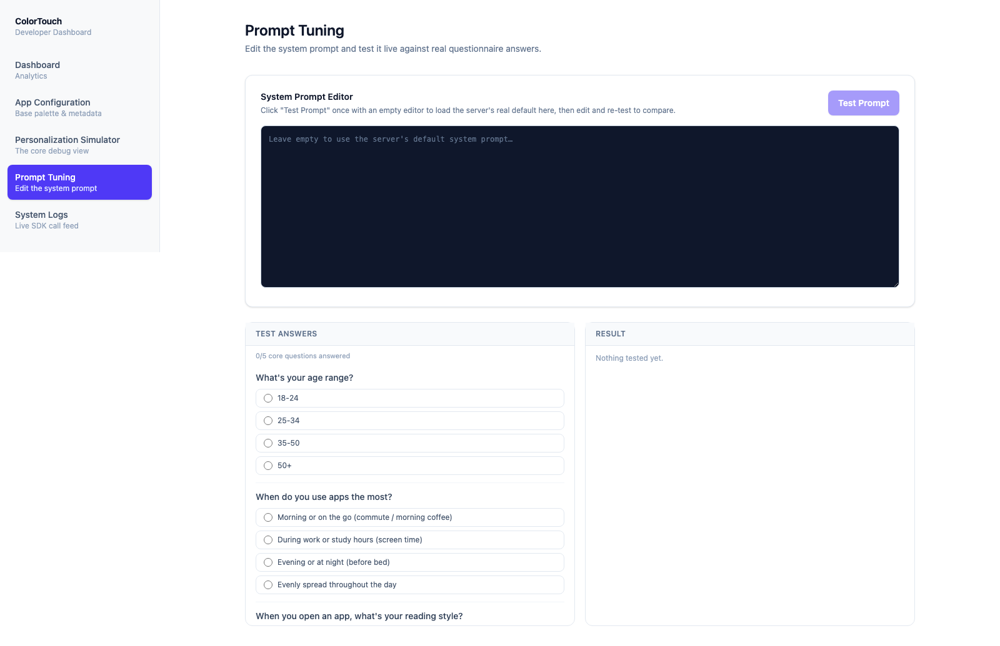
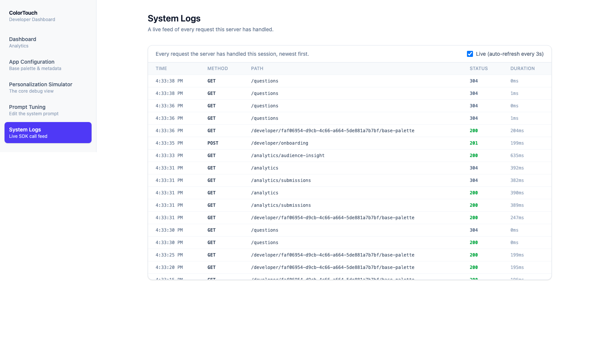
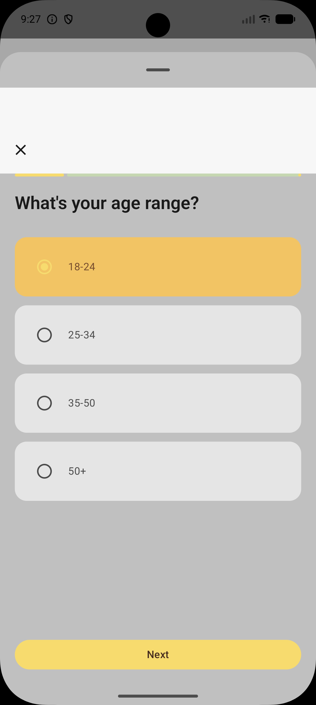
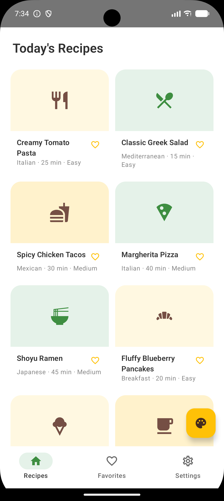
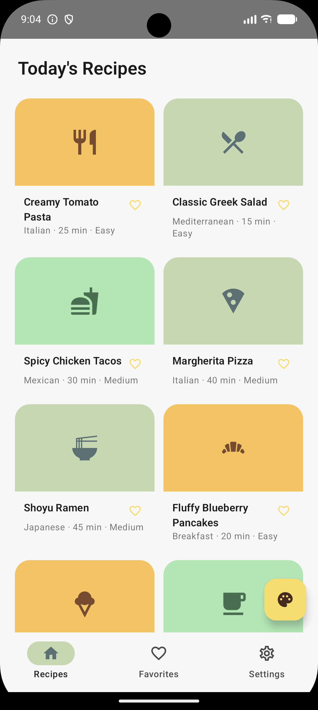

# ColorTouch System

**Seminar Project — Advanced Seminar in Mobile Development**
**Afeka College of Engineering**

**Student:** Hila Hindi

---

## Table of Contents

1. [Project Overview](#1-project-overview)
2. [Screenshots & Demo](#2-screenshots--demo)
3. [Tech Stack](#3-tech-stack)
4. [Project Structure](#4-project-structure)
5. [API Reference](#5-api-reference)
6. [Setup & Running Locally](#6-setup--running-locally)
7. [Design Decisions](#7-design-decisions)

---

## 1. Project Overview

**ColorTouch** is a service that generates a Material3 color palette for an
app, then personalizes it per end user from a short in-app questionnaire —
using an LLM (Groq/Llama) acting as a color-psychology "design consultant."
This repo is the backend + developer dashboard half of the system:

| Layer                  | Technology                               | Purpose                                                                                                                     |
| ---------------------- | ---------------------------------------- | --------------------------------------------------------------------------------------------------------------------------- |
| Server                 | Node.js + Express + TypeScript           | Onboarding, personalization, questions, analytics — the API everything else talks to                                        |
| Developer Dashboard    | React + TypeScript + Vite + Tailwind     | App configuration, submissions analytics, personalization simulator, prompt tuning, live request logs                       |
| Android SDK + demo app | Kotlin + Jetpack Compose (separate repo) | Consumes this API and renders the returned palette live — see [ColorTouch-SDK](https://github.com/hilahindi/ColorTouch-SDK) |
| AI provider            | Groq (Llama 3.3 70B)                     | Generates palettes and personalization reasoning; fully mockable for cost-free development                                  |
| Database               | MongoDB Atlas                            | Persists base palettes, personalized palettes, questionnaire answers, and submissions                                       |

Three moving parts: a developer **onboards** their app once and the LLM
generates a Material3 `BasePalette`; each end user **personalizes** it via a
short in-app questionnaire, which the LLM turns into a tailored light/dark
palette plus a written design rationale; and the dashboard's **analytics**
surface every submission, per-question answer distributions, and an
on-demand AI summary of who the app's actual audience turned out to be.

---

## 2. Screenshots & Demo

### Developer Dashboard

<table>
<tr>
<td align="center"><br><sub>Dashboard (KPIs + submissions)</sub></td>
<td align="center"><br><sub>Submission detail (palette + AI reasoning)</sub></td>
<td align="center"><br><sub>Answer distribution + Audience Insight</sub></td>
</tr>
<tr>
<td align="center"><br><sub>App Configuration (onboarding)</sub></td>
<td align="center"><br><sub>Personalization Simulator (debug view)</sub></td>
<td align="center"><br><sub>Prompt Tuning</sub></td>
</tr>
<tr>
<td align="center"><br><sub>System Logs</sub></td>
<td></td>
<td></td>
</tr>
</table>

### Android App

The bundled sample app, **ColorTouch Recipes** (from the
[ColorTouch-SDK](https://github.com/hilahindi/ColorTouch-SDK) repo), renders
every color on screen — cards, icons, buttons — from a palette this server
generated. Tapping the palette button re-opens the in-app questionnaire —
itself themed live with the current palette — and requests a fresh
personalization; five different sets of answers already produce five
visually distinct, coherent Material3 themes on the exact same layout, live,
with no app restart:

<table>
<tr>
<td align="center"></td>
<td align="center"></td>
<td align="center"></td>
<td align="center"></td>
<td align="center"></td>
<td align="center"></td>
</tr>
</table>

**[Full demo video](docs/screenshots/demo.webm)** —
browsing the recipe app, opening the questionnaire, and watching the whole
UI re-theme live after each submission.

---

## 3. Tech Stack

| Layer                   | Technology                    |
| ----------------------- | ----------------------------- |
| Server language/runtime | TypeScript, Node.js           |
| Server framework        | Express                       |
| Database                | MongoDB (Atlas)               |
| AI provider             | Groq SDK (Llama 3.3 70B)      |
| Schema validation       | Ajv (JSON Schema, draft-07)   |
| Dashboard framework     | React + TypeScript            |
| Dashboard build tool    | Vite                          |
| Dashboard styling       | Tailwind CSS                  |
| API testing             | Postman collection (included) |

---

## 4. Project Structure

```
ColorTouch-System/
├── server/
│   ├── src/
│   │   ├── app.ts                          # Composition root: wires repositories, cache, AI provider, routes
│   │   ├── api/
│   │   │   ├── routes/                     # onboarding, personalization, questions, analytics, logs
│   │   │   ├── controllers/                # HTTP-facing request/response mapping
│   │   │   └── middleware/                 # Field presence + schema validation
│   │   ├── services/
│   │   │   ├── palette/                    # onboarding.service.ts, personalizedPalette.service.ts
│   │   │   ├── ai/                         # aiClient.ts (GroqAiProvider), promptBuilder.ts
│   │   │   ├── questions/                  # Canonical question set
│   │   │   ├── submissions/                # Submission stats aggregation
│   │   │   └── logs/                       # In-memory request log
│   │   ├── repositories/                   # Mongo-backed persistence, one per collection
│   │   ├── cache/                          # PersonalizedPaletteCache interface + in-memory impl
│   │   ├── db/                             # Mongo connection
│   │   ├── validation/                     # Ajv schema validator
│   │   ├── schemas/                        # JSON Schemas: BasePalette, PersonalizedPalette, UserAnswers, AppMetadata, ColorScheme
│   │   └── types/                          # Shared TypeScript types
│   └── package.json
│
├── frontend-portal/
│   ├── src/
│   │   ├── App.tsx                         # Tab-based navigation (no router)
│   │   ├── pages/                          # Dashboard, AppConfig, PromptTuning, SystemLogs
│   │   ├── components/                     # SubmissionsTable, PersonalizationSimulator, charts, layout
│   │   └── hooks/                          # useSubmissions, useQuestions
│   └── package.json
│
├── docs/
│   └── screenshots/                        # Dashboard + Android app screenshots used in this README
│
└── ColorTouch.postman_collection.json      # Every endpoint, ready to import
```

---

## 5. API Reference

| Endpoint                               | Method | Description                                                             |
| -------------------------------------- | ------ | ----------------------------------------------------------------------- |
| `/developer/onboarding`                | POST   | Generate and persist a developer's `BasePalette` from app metadata      |
| `/developer/:developerId/base-palette` | GET    | Fetch a developer's current `BasePalette` (polled by the Android SDK)   |
| `/personalized-palette`                | POST   | Personalize a palette for one end user from their questionnaire answers |
| `/questions`                           | GET    | The canonical question set (5 core + 10 deep-dive)                      |
| `/analytics`                           | GET    | Apps onboarded, personalizations generated, unique users, AI mode       |
| `/analytics/submissions`               | GET    | Every recorded submission for a developer                               |
| `/analytics/submissions/:submissionId` | DELETE | Delete one submission (cascades to its palette + answers)               |
| `/analytics/submissions`               | DELETE | Clear all submissions for a developer (cascades)                        |
| `/analytics/audience-insight`          | GET    | AI-generated "who is this app for" summary                              |
| `/logs`                                | GET    | Live feed of every request this server instance has handled             |

Import [`ColorTouch.postman_collection.json`](ColorTouch.postman_collection.json)
into Postman for realistic example bodies and collection variables
(`baseUrl`, `developerId`) for every endpoint above.

---

## 6. Setup & Running Locally

### Prerequisites

- Node.js and npm
- A MongoDB Atlas connection string
- A Groq API key (only required for `npm run dev:live`)

### Step 1 — Start the Server

```bash
cd server
npm install
```

Create `server/.env`:

```
GROQ_API_KEY=your_groq_api_key
MONGODB_URI=your_mongodb_atlas_connection_string
```

```bash
npm run dev        # mock AI mode — no Groq calls, deterministic fixtures
npm run dev:live    # NODE_ENV=production — real Groq calls
```

Server listens on `http://localhost:3000`.

### Step 2 — Start the Developer Portal

```bash
cd frontend-portal
npm install
npm run dev
```

Opens on `http://localhost:5173` (the server's CORS defaults to this origin —
set `PORTAL_ORIGIN` in `server/.env` if you run the portal elsewhere).

### Step 3 — Run the Sample Android App

See [ColorTouch-SDK](https://github.com/hilahindi/ColorTouch-SDK) — clone it
separately and open it in Android Studio. Onboard an app via this portal's
**App Configuration** page first — the sample app only _fetches_ a base
palette, it doesn't onboard one itself.

### Step 4 — Verify End-to-End

1. Onboard an app in **App Configuration** — a base palette appears immediately.
2. Run the Android sample app — it picks up that base palette.
3. Complete the in-app questionnaire — the app re-themes live.
4. Check the **Dashboard** — the submission, its palette, and the AI's
   reasoning all appear within a couple of seconds.

---

## 7. Design Decisions

| Decision                                                       | Rationale                                                                                                                                                                                                                                        |
| -------------------------------------------------------------- | ------------------------------------------------------------------------------------------------------------------------------------------------------------------------------------------------------------------------------------------------ |
| `NODE_ENV`-gated mock/live AI provider                         | The entire flow — SDK, dashboard, every endpoint — is exercisable end-to-end with zero Groq cost during development. Only `npm run dev:live` ever calls the real API.                                                                            |
| Retrying AI client (up to 3 attempts)                          | A malformed completion or transient network error is retried automatically rather than surfacing an error on the first hiccup; after 3 failures it returns a 503 the SDK is expected to react to by falling back to its bundled default palette. |
| JSON Schema validation gate before persistence                 | Every AI response (base palette, personalized palette, audience insight) is validated against an Ajv schema before being saved or returned — a malformed generation is retried, never shipped to an end user.                                    |
| Cache keyed by `userId`, invalidated by `base_palette_version` | A returning user only triggers a fresh (costly) AI regeneration if the developer's base palette actually changed since their last personalization; otherwise the cached result is reused and still recorded as a submission.                     |
| Cascading deletes across 3 collections                         | Deleting a submission (or "Clear all") also removes its `personalized_palettes` and `user_answers` records, so the dashboard's KPI tiles stay numerically consistent with the submissions table instead of silently diverging.                   |
